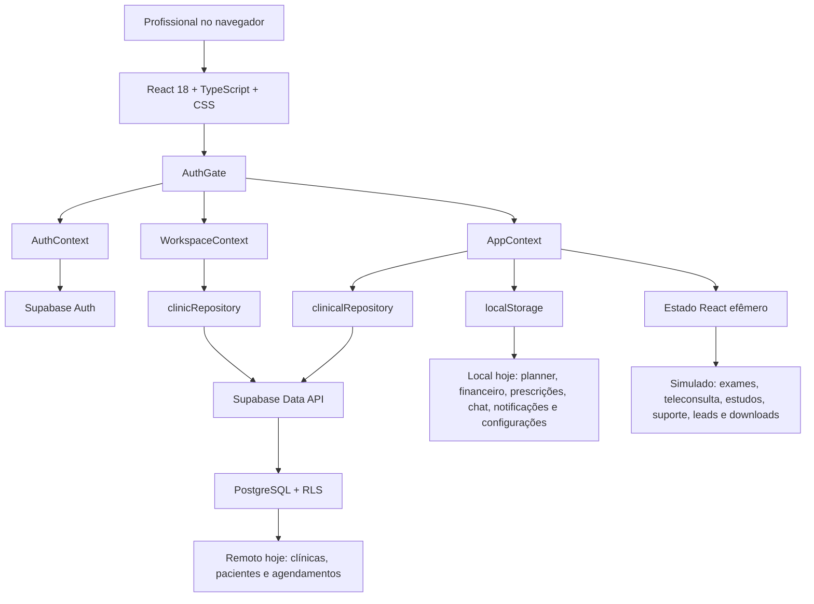
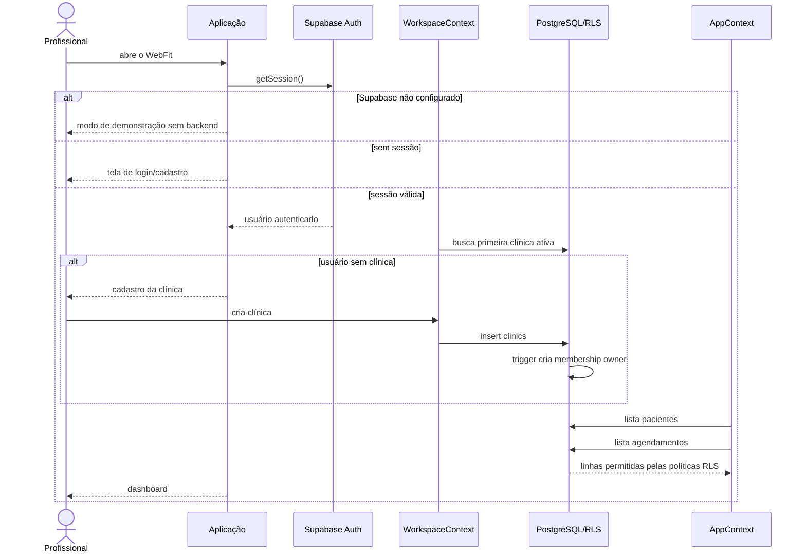
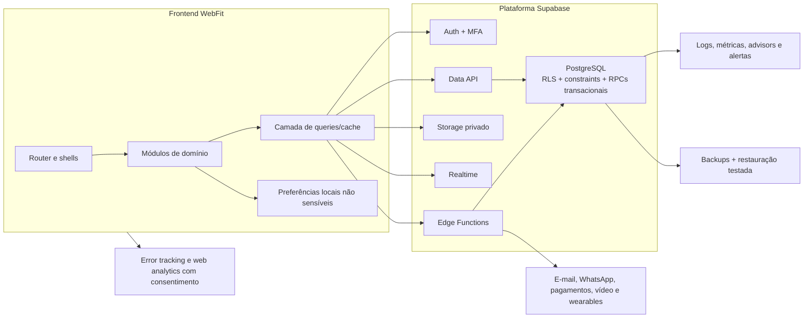

# Arquitetura atual e arquitetura-alvo

## Arquitetura atual

O WebFit é uma SPA React entregue pelo Vite. Três contextos formam o núcleo: autenticação, clínica ativa e estado do produto. Somente pacientes e agendamentos atravessam repositórios Supabase; o restante permanece no estado do navegador.



## Inicialização e acesso



## Componentes e responsabilidades

| Componente | Responsabilidade atual | Limite/recomendação |
|---|---|---|
| `main.tsx` | monta React e ErrorBoundary | adequado |
| `App.tsx` | composição de providers, navegação e modal do perfil | mover perfil e roteamento para módulos dedicados |
| `AuthContext` | sessão, login, cadastro e logout | adicionar recuperação de senha, confirmação e MFA conforme risco |
| `WorkspaceContext` | busca/cria clínica ativa | suportar troca de clínica, equipe e estados de convite |
| `AppContext` | estado e comandos de quase todos os domínios | dividir por domínio e usar cache de dados remotos |
| `clinicRepository` | leitura/criação de clínicas | acrescentar membros, convites e seleção persistida |
| `clinicalRepository` | CRUD de pacientes e agenda | separar por agregado e padronizar erros/mapeamento |
| `storage.ts` | wrapper defensivo de `localStorage` | limitar a preferências não sensíveis |
| Supabase | Auth, Data API, Postgres, RLS, Storage e Realtime previstos | validar em staging e fechar integridade/autorização |

## Tecnologias usadas

| Tecnologia | Uso | Avaliação |
|---|---|---|
| React 18.3 | UI declarativa | sólido; pode evoluir sem migração imediata |
| TypeScript 6 | tipagem estrita | ponto forte; tipos de banco já gerados |
| Vite 8 | desenvolvimento e build | rápido; code splitting básico configurado |
| Vanilla CSS | tokens, temas e layout | reduz dependências; arquivos grandes pedem organização por componente |
| Supabase JS 2.112 | Auth e Data API | adequado ao MVP; versão fixada |
| PostgreSQL 17 | domínio, integridade e auditoria | adequado a dados clínicos e multi-tenancy |
| Supabase RLS | isolamento por clínica | boa fundação; políticas precisam ficar sensíveis a papéis |
| Supabase Storage | bucket privado previsto | ainda não integrado à UI |
| Supabase Realtime | publicação de mensagens/notificações | preparado no banco, não consumido pelo frontend |
| Vitest + Testing Library | testes unitários/componentes | baseline funcional, cobertura crítica ainda pequena |
| ESLint | análise estática | configurado e aprovado |

## Arquitetura-alvo recomendada

Não é necessário introduzir um backend tradicional agora. O caminho mais simples é consolidar o Supabase como backend transacional, usar Edge Functions somente para segredos/integrações e separar o frontend em módulos de domínio.



### Estrutura sugerida do frontend

```text
src/
├── app/                    # providers, router, guards e layout
├── domains/
│   ├── patients/           # UI, hooks, schemas e repository
│   ├── appointments/
│   ├── prescriptions/
│   ├── anthropometry/
│   ├── finance/
│   ├── messaging/
│   └── workspace/
├── shared/
│   ├── api/                # cliente, erros, paginação e cache
│   ├── ui/                 # componentes acessíveis
│   ├── validation/         # schemas compartilhados
│   └── observability/
└── styles/
```

## Tecnologias a introduzir

As escolhas abaixo são recomendações, não dependências já existentes.

| Necessidade | Recomendação | Quando introduzir |
|---|---|---|
| Rotas e URLs compartilháveis | React Router | ao dividir páginas e suportar deep links |
| Cache e mutações remotas | TanStack Query | antes de migrar o terceiro domínio para Supabase |
| Formulários/validação | React Hook Form + Zod | ao padronizar pacientes, agenda e prescrições |
| Testes E2E | Playwright | imediatamente para login, clínica, paciente e agenda |
| Mock de API | MSW | para testes determinísticos do frontend |
| Componentes/documentação visual | Storybook, opcional | quando biblioteca compartilhada ganhar escala |
| Telemetria de erros | Sentry ou equivalente | antes de piloto externo; sem enviar dados clínicos |
| Métricas de produto | PostHog ou equivalente | após política de consentimento e plano de eventos |
| Integrações secretas | Supabase Edge Functions | e-mail, WhatsApp, pagamentos, webhooks e tokens OAuth |
| CI/CD | GitHub Actions + provedor de hospedagem | antes de staging compartilhado |
| Teste de carga | k6 | antes do piloto e após queries críticas |

## Princípios arquiteturais

1. O banco é a fonte de verdade de dados clínicos; `localStorage` guarda apenas preferências de interface.
2. Toda tabela multi-tenant carrega `clinic_id`, e relações devem garantir que os dois lados pertençam à mesma clínica.
3. A autorização é validada no banco; esconder botões não é controle de acesso.
4. Operações compostas críticas devem ser atômicas em RPC/função transacional.
5. Edge Functions guardam segredos e adaptam sistemas externos; o navegador nunca recebe credenciais privadas.
6. Cada domínio possui seus tipos, repositório, queries, comandos, testes e regras próximos.
7. Observabilidade nunca deve registrar CPF, prontuário, conteúdo de mensagem ou arquivo clínico.
8. Mudanças de schema são migradas, revisadas, testadas em staging e acompanhadas de plano de rollback.

## Pontos de evolução da arquitetura atual

- Substituir a seleção condicional de páginas por rotas e carregamento preguiçoso.
- Dividir `AppContext` em sessão de UI e estados de servidor por domínio.
- Fragmentar `PatientProfile` em rotas/abas independentes.
- Padronizar retorno dos repositórios, mensagens de erro e estados de loading/empty/error.
- Gerar tipos do banco no pipeline e detectar divergência de schema.
- Criar RPC para “agendar retorno + gerar cobrança” quando essa regra for confirmada.
- Criar uma camada de autorização por papel e testes negativos por tenant.
