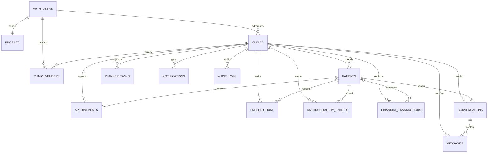
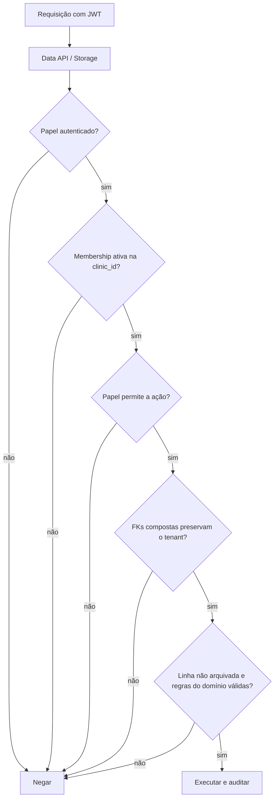

# Dados, segurança e privacidade

## Modelo de dados atual

O schema inicial cria 13 tabelas públicas, tipos enumerados, bucket privado, publicação Realtime, RLS, auditoria e soft delete. As migrações seguintes completam autoria (`created_by`, `updated_by`, `deleted_by`), bloqueiam exclusão física pelo papel autenticado e adicionam índices para FKs de auditoria.

## Dicionário resumido

| Tabela | Finalidade | Dados sensíveis principais | Integrada à UI? |
|---|---|---|---|
| `profiles` | identidade profissional | nome, CRN, telefone, avatar | parcial |
| `clinics` | tenant/consultório | nome, timezone, proprietário | sim |
| `clinic_members` | equipe e papel | vínculo de usuário e função | leitura indireta |
| `patients` | cadastro e anamnese | CPF, contato, nascimento, notas clínicas | sim |
| `appointments` | consultas | paciente, profissional, data, modalidade, notas | sim |
| `prescriptions` | prescrições | conteúdo clínico JSON | não |
| `anthropometry_entries` | medições | peso, altura, gordura e medidas | não |
| `financial_transactions` | caixa | cliente, valor, método e status | não |
| `planner_tasks` | tarefas | agenda operacional | não |
| `conversations` | thread por paciente | associação clínica-paciente | não |
| `messages` | mensagens | conteúdo de comunicação clínica | não |
| `notifications` | alertas | payload potencialmente clínico | não |
| `audit_logs` | trilha de alterações | ator, entidade, ação e campos alterados | não |

## Controles já implementados

- RLS habilitada em todas as tabelas públicas.
- Acesso `anon` revogado para as tabelas públicas.
- Cliente frontend usa chave publicável, não `service_role`.
- Políticas baseadas em associação ativa à clínica.
- `USING` e `WITH CHECK` presentes nas políticas de atualização relevantes.
- Funções privadas usam `search_path = ''` e privilégios de execução são revogados.
- Soft delete com `deleted_at/deleted_by` e políticas restritivas que ocultam arquivados.
- Auditoria automática por trigger para create/update/delete/restore.
- Exclusão física revogada do papel `authenticated`.
- Bucket `clinical-files` privado, com limite de 10 MiB e MIME types restritos.
- Índices gerais, parciais de linhas ativas e índices de chaves estrangeiras.
- Tokens locais configurados com expiração de uma hora e rotação de refresh token.

## Riscos prioritários encontrados

### P0 — Integridade multi-tenant incompleta

As tabelas filhas possuem `clinic_id` e também FKs simples como `patient_id` ou `conversation_id`. O banco não garante que a entidade referenciada pertence à mesma clínica da linha inserida. Exemplo: uma linha de `appointments` pode declarar `clinic_id = A` e apontar para um paciente da clínica B se o ID for conhecido; a política atual verifica somente a associação do usuário à clínica A.

Afeta pelo menos agendamentos, prescrições, antropometria, financeiro, conversas e mensagens. Corrigir com chaves únicas compostas e FKs compostas, por exemplo `(clinic_id, patient_id) -> patients(clinic_id, id)`, além de testes negativos.

### P0 — Dados sensíveis no navegador

Prescrições, finanças, conversas, notificações e configurações permanecem em `localStorage`. Qualquer script executado na origem, extensão maliciosa, perfil compartilhado ou XSS pode acessá-los. O armazenamento também não isola usuários diferentes usando o mesmo navegador.

Migrar todos os dados clínicos/financeiros para o backend e apagar as chaves legadas de maneira controlada. Manter localmente apenas tema e preferências não sensíveis.

### P0 — Prontidão LGPD não demonstrada

O produto trata dados pessoais e dados de saúde, que exigem governança reforçada. O repositório não demonstra registro de base legal/consentimento, aviso de privacidade, inventário de tratamento, retenção, exportação/correção, resposta a titulares, processo de incidente ou operadores/suboperadores.

Isso exige decisão jurídica e operacional, não apenas código. Não usar dados reais antes dessa definição.

### P1 — Papéis existem, mas não autorizam de forma diferente

`owner`, `nutritionist` e `assistant` estão no enum, porém as políticas de negócio usam apenas “membro ativo”. Assim, um assistente pode receber os mesmos poderes de escrita clínica/financeira que um nutricionista, dependendo dos grants. Definir matriz de permissão e políticas por ação/papel.

### P1 — Políticas do Storage precisam de endurecimento

- `UPDATE` e `DELETE` verificam propriedade do objeto, mas não confirmam associação atual à clínica do primeiro segmento do caminho.
- Uma pessoa removida da clínica pode continuar proprietária de um objeto e tentar alterá-lo/excluí-lo.
- O modelo de hard delete das tabelas não se estende aos arquivos; retenção e lixeira precisam ser definidas.
- O cliente ainda não usa o bucket, logo upsert, download assinado e expiração não foram testados.

Adicionar checagem de membership ativa em todas as operações e padronizar caminho `clinic_id/patient_id/category/object-id.ext`.

### P1 — Configuração de autenticação é de desenvolvimento

Na configuração local, confirmação de e-mail, CAPTCHA, MFA e troca segura de senha estão desabilitados; senha mínima é 6. Para produção, exigir e-mail confirmado, senha mais forte ou passwordless bem protegido, recuperação de conta, CAPTCHA/rate limits e MFA para perfis de maior privilégio.

### P1 — Auditoria não foi exercitada em banco real

Os testes atuais verificam presença de texto nas migrações, não comportamento. É preciso comprovar:

- ator correto em inserção/atualização/arquivamento;
- impossibilidade de alterar `created_by`;
- cascata lógica do paciente;
- invisibilidade de arquivados;
- visibilidade correta de logs por papel;
- comportamento de triggers `SECURITY DEFINER` sob RLS;
- ausência de recursão/impacto de performance em volume.

### P2 — Auditoria registra campos, não valores

O desenho atual salva lista de campos alterados e referência do ator, o que reduz exposição de dados, mas não permite reconstruir o valor anterior. Definir, com jurídico e negócio, se isso é suficiente. Evitar gravar prontuário integral no log sem política de retenção e acesso.

### P2 — Dados identificadores sem normalização

CPF, telefone, e-mail, método de pagamento e gênero são textos livres. Faltam normalização, validação, unicidade contextual e pesquisa segura. Evitar prometer criptografia de coluna como solução universal: primeiro reduza coleta, normalize, restrinja acesso e defina necessidade real de busca.

## Modelo de autorização recomendado

| Ação | Owner | Nutritionist | Assistant |
|---|---:|---:|---:|
| Administrar clínica e equipe | sim | não | não |
| Ler cadastro de pacientes | sim | sim | conforme função |
| Alterar cadastro clínico | sim | sim | limitado |
| Ler/escrever prontuário e prescrição | sim | sim | não por padrão |
| Gerenciar agenda | sim | sim | sim |
| Ler/escrever financeiro | sim | configurável | configurável/limitado |
| Ler auditoria | sim | apenas própria ou conforme governança | não |
| Excluir/arquivar dados | owner e papéis explicitamente autorizados | configurável | não |

Essa matriz precisa ser confirmada por stakeholders e transformada em testes de política, não apenas em controles visuais.

## Fluxo de autorização esperado

## Backup, continuidade e retenção

Definir formalmente:

- RPO e RTO do produto;
- backup diário ou PITR conforme criticidade/plano;
- exportação lógica independente e criptografada quando aplicável;
- teste trimestral de restauração em ambiente isolado;
- retenção diferente para prontuário, financeiro, mensagens, arquivos e auditoria;
- procedimento de indisponibilidade do Supabase;
- inventário de contatos e responsáveis por incidente.

Backups só são confiáveis depois de uma restauração testada. Para produção, também rodar Security Advisor e Performance Advisor após cada mudança relevante.

## Checklist antes do piloto

- [ ] Corrigir FKs compostas multi-tenant.
- [ ] Implementar e testar matriz de papéis.
- [ ] Remover dados sensíveis do `localStorage`.
- [ ] Criar testes de RLS com dois tenants e cada papel.
- [ ] Revisar Storage para membership atual e retenção.
- [ ] Habilitar confirmação de e-mail, CAPTCHA e MFA conforme perfil.
- [ ] Configurar SMTP próprio e templates confiáveis.
- [ ] Executar advisors e corrigir achados.
- [ ] Definir LGPD, retenção e resposta a incidentes.
- [ ] Testar backup e restauração.
- [ ] Revisar logs/telemetria para impedir vazamento de dados clínicos.

## Referências técnicas

- [Supabase — Row Level Security](https://supabase.com/docs/guides/database/postgres/row-level-security)
- [Supabase — Storage Access Control](https://supabase.com/docs/guides/storage/security/access-control)
- [Supabase — Performance and Security Advisors](https://supabase.com/docs/guides/database/database-advisors)
- [Supabase — Production Checklist](https://supabase.com/docs/guides/deployment/going-into-prod)
- [Supabase — Database Backups](https://supabase.com/docs/guides/platform/backups)
