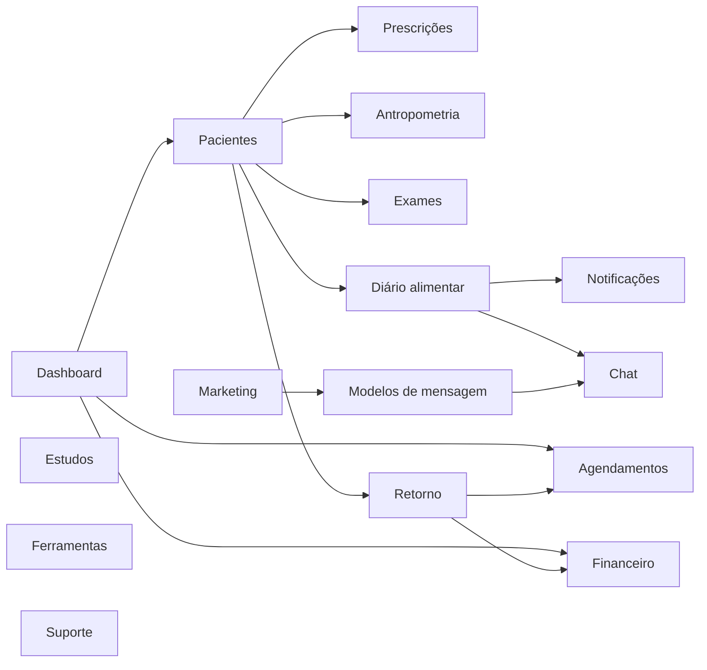
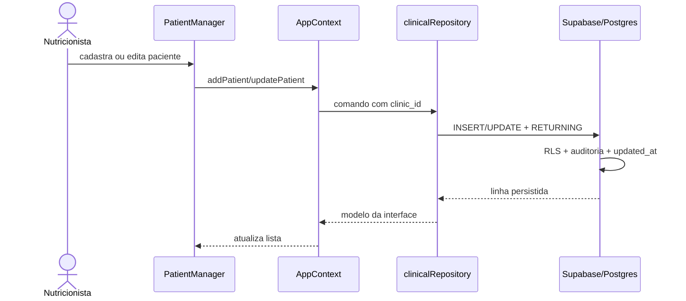
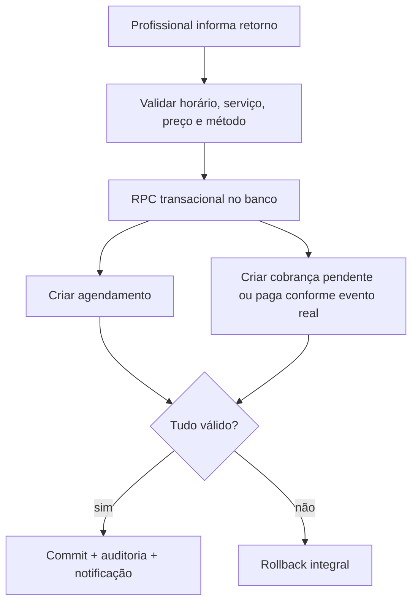

# Módulos e fluxos de negócio

## Mapa funcional

## Autenticação e clínica

### Implementado

- Login e cadastro por e-mail/senha.
- Restauração e acompanhamento de sessão.
- Logout.
- Busca da primeira clínica ativa vinculada ao usuário.
- Criação de clínica para usuário sem workspace.

### Falta

- confirmação e recuperação de e-mail/senha na UI;
- convite e gestão de membros;
- seleção entre múltiplas clínicas;
- edição da clínica e timezone;
- estados para membership inativa/convite pendente;
- MFA e reautenticação para ações sensíveis.

## Dashboard

### Implementado

- indicadores de pacientes, próximos atendimentos e receita;
- lista pesquisável de pacientes e aniversariantes;
- planner por data;
- configurações do app do paciente;
- gráfico de consultas nos últimos 13 meses;
- atalhos para módulos.

### Limites

Pacientes e agenda vêm do banco. Receita, planner, prescrições e configurações vêm do navegador. Portanto, os números não formam ainda uma visão transacional única da clínica.

## Pacientes

### Fluxo operacional remoto

### Regras atuais

- Nome é obrigatório.
- Apelido assume o primeiro nome se vazio.
- Busca considera nome, apelido, CPF, telefone e tags.
- Ordenação por modificação e alfabética funciona.
- Remoção é arquivamento lógico com confirmação.
- Tags podem ser adicionadas/removidas diretamente no card.

### Lacunas

- validação e máscara de CPF, telefone e e-mail;
- duplicidade por clínica;
- paginação e busca no servidor;
- filtros de período/login realmente funcionais;
- controle de concorrência/edição simultânea;
- histórico de alterações visível;
- importação/exportação reais;
- consentimento e preferências de contato.

## Perfil clínico do paciente

O perfil possui nove abas: perfil, anamnese, cardápio, exames, pré-consulta, iMetas, diário, impressos e retorno.

| Aba | Estado | Próxima entrega necessária |
|---|---|---|
| Perfil | parcial remoto | salvar acessos/configurações e exibir histórico |
| Anamnese | remoto dentro de `clinical_notes` | estruturar versões/seções e autoria |
| Cardápio | local | editor de conteúdo, versionamento, publicação e PDF |
| Exames | estático | modelar exames, referências, anexos e interpretação responsável |
| Pré-consulta | simulado | templates, envio, token do paciente, respostas e consentimento |
| iMetas | efêmero | persistência, recorrência, adesão e permissões de plano reais |
| Diário | simulado/local | upload seguro, timeline, comentários e Realtime |
| Impressos | simulado | geração de PDF, assinatura, versionamento e armazenamento |
| Retorno | híbrido | operação transacional e preço configurável |

### Antropometria

A interface calcula IMC e mantém histórico somente enquanto o componente existe. A tabela remota já suporta peso, altura, percentual de gordura e medidas JSON. Criar repositório, validação clínica, unidade explícita, autoria e gráfico longitudinal.

## Agendamentos

### Implementado

- criação vinculada a paciente;
- data, hora e modalidade;
- listagem crescente;
- cancelamento lógico;
- gráfico mensal derivado da agenda.

### Melhorias

- usar timezone da clínica no parsing/formatação;
- detectar conflito de profissional/sala;
- editar, remarcar, confirmar, concluir e marcar ausência;
- duração configurável;
- lembretes idempotentes;
- agenda por profissional em clínicas com equipe;
- integração com calendário externo somente após consentimento e gestão de tokens.

## Retorno e cobrança

Hoje o retorno executa duas ações independentes: cria o agendamento remoto e adiciona uma transação local fixa de R$ 250 via PIX. Esse comportamento mistura demonstração com regra financeira.

Fluxo-alvo:

Não marcar automaticamente como “Pago” sem confirmação de recebimento ou webhook do provedor.

## Financeiro

### Atual

- registra entradas de paciente ou cliente avulso;
- calcula receita total e contagem;
- aceita PIX, cartão, dinheiro e transferência;
- persiste localmente.

### Alvo mínimo

- usar `financial_transactions`;
- separar cobrança, pagamento, estorno e conciliação;
- guardar centavos/numeric sem conversões imprecisas;
- limitar acesso por papel;
- relatórios por competência/caixa;
- exportação contábil;
- integração de pagamentos por Edge Function e webhooks idempotentes.

## Chat, diário e notificações

### Atual

Mensagens, uploads simulados e notificações formam um fluxo local integrado. O banco já contém `conversations`, `messages`, `notifications` e publicação Realtime, mas a interface não assina canais nem persiste mensagens.

### Alvo

1. Fazer upload de foto ao bucket privado usando caminho multi-tenant.
2. Criar registro de refeição (nova tabela necessária) com referência ao objeto.
3. Criar notificação do profissional.
4. Assinar mudanças autorizadas via Realtime.
5. Enviar feedback como mensagem persistida.
6. Usar signed URLs curtas para visualizar arquivos.
7. Definir leitura, edição, moderação, retenção e remoção.

O schema atual não possui uma tabela específica para refeições/diário; `notifications.payload` não deve se tornar a fonte de verdade desse domínio.

## Planner e configurações do app

O planner e preferências funcionam localmente. Migrar tarefas para `planner_tasks`. Para configurações do app do paciente, criar uma tabela versionada por clínica/paciente conforme o escopo real; não misturar preferências globais do profissional com consentimento do paciente.

## Marketing

### Atual

- editor visual de post com preview;
- site builder com preview;
- leads apenas em memória;
- modelos de mensagem locais;
- automações e links simulados.

### Evolução

- exportação real via Canvas API ou serviço de renderização;
- publicação de landing page isolada e segura;
- tabela de leads, consentimento, origem e opt-out;
- templates versionados;
- fila de automações com idempotência, horários e auditoria;
- comunicação por provedor externo somente via backend seguro.

## Estudos e ferramentas

Estudos, MoveHealth, benefícios e teleconsulta são experiências demonstrativas. Antes de integrar:

- definir parceiro, contrato, privacidade e modelo de custo;
- identificar dados que cruzam sistemas;
- guardar tokens OAuth em backend seguro;
- desenhar falha/reconexão e suporte;
- validar regulamentação e consentimento;
- para vídeo, decidir entre provedor gerenciado e WebRTC próprio; não prometer criptografia/gravação sem evidência técnica.

## Suporte

O formulário não envia chamado. Integrar a um helpdesk por Edge Function ou API server-side, retornar protocolo real e impedir que o usuário envie dados clínicos desnecessários na descrição.

## Regras de negócio a confirmar com stakeholders

1. Um profissional pode atuar em quantas clínicas e com quais papéis?
2. Assistentes podem ver prontuário, mensagens e financeiro?
3. Quais ações exigem assinatura/CRN do nutricionista?
4. O que é uma prescrição publicada versus rascunho?
5. Como funcionam cobrança, inadimplência, estorno e nota fiscal?
6. Qual é o ciclo de vida de paciente arquivado e possibilidade de restauração?
7. Por quanto tempo manter prontuário, chat, fotos, documentos e auditoria?
8. O paciente terá um app/portal próprio? Como autentica e consente?
9. Quais recursos pertencem a cada plano e como o entitlement é verificado no servidor?
10. Quais integrações externas são realmente prioritárias?
