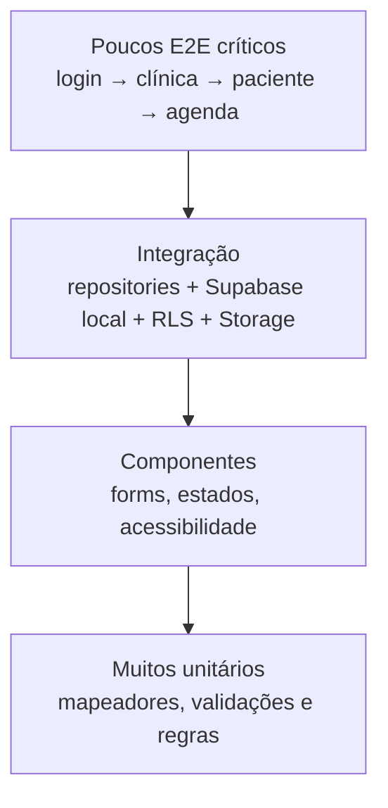
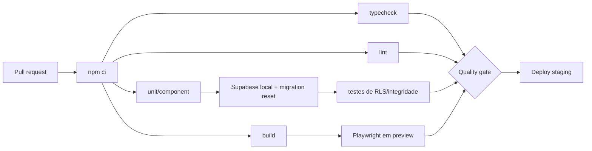

# Qualidade, operação e desenvolvimento

## Ambiente de desenvolvimento

### Requisitos

- Node.js 22 ou compatível com Vite 8.
- npm 10+.
- Docker para Supabase local.
- Git.

### Configuração

```bash
npm install
cp .env.example .env.local
npm run dev
```

No PowerShell, `Copy-Item .env.example .env.local` substitui `cp`. Se a política bloquear `npm.ps1`, execute `npm.cmd`.

Variáveis:

| Nome | Escopo | Segredo? |
|---|---|---|
| `VITE_SUPABASE_URL` | URL pública da API Supabase | não |
| `VITE_SUPABASE_PUBLISHABLE_KEY` | chave publicável do cliente | não, mas deve ser controlada com RLS |

Nunca usar `service_role`/secret key em variável `VITE_*`, pois o valor entra no bundle público.

## Qualidade observada em 12/08/2026

| Verificação | Resultado |
|---|---|
| `npm run typecheck` | passou |
| `npm run lint` | passou |
| `npm test` | 5 arquivos, 24 testes aprovados |
| `npm run build` | passou; bundle gerado |
| auditoria npm | inconclusiva por falha de acesso ao registry no ambiente |

O bundle observado continha aproximadamente 49 kB de CSS e 307 kB de JavaScript antes de gzip, dividido entre runtime, React e aplicação. Não há orçamento de performance formal.

## Cobertura atual de testes

- navegação para Marketing, Ferramentas e Suporte;
- estado inicial sem fixtures de demonstração;
- wrapper defensivo de `localStorage`;
- janela móvel de 13 meses;
- verificações textuais de RLS, bucket, auditoria e hard-delete nas migrações.

### O que não está coberto

- login/cadastro/recuperação reais;
- criação e troca de clínica;
- CRUD remoto de pacientes e agenda;
- comportamento real de RLS/triggers/Storage;
- isolamento entre clínicas;
- falhas de rede, timeout e retry;
- fluxos do perfil de paciente;
- acessibilidade e teclado;
- responsividade visual;
- E2E em navegador;
- concorrência e transações;
- performance e carga.

## Pirâmide de testes recomendada



### Casos obrigatórios de segurança

1. Usuário A da clínica A não lê nem altera qualquer linha da clínica B.
2. Usuário removido perde acesso a linhas e arquivos imediatamente.
3. Assistant não executa ação reservada a nutritionist/owner.
4. `clinic_id` e entidades relacionadas não podem cruzar tenants.
5. Arquivado some das consultas normais e preserva auditoria.
6. Alterar `created_by` pelo cliente falha ou é sobrescrito.
7. Chave pública sem sessão não acessa dados.
8. Upload rejeita MIME, tamanho ou caminho inválido.

## Pipeline CI recomendado



Adicionar também secret scanning, dependabot/renovate, auditoria de dependências e geração/verificação dos tipos do banco.

## Estratégia de ambientes

| Ambiente | Dados | Finalidade |
|---|---|---|
| local | sintéticos | desenvolvimento e testes |
| preview/branch | sintéticos | revisão por PR e migrações |
| staging | anonimizados/sintéticos | homologação integrada e carga |
| produção | reais | operação, com acesso mínimo e auditoria |

Nunca copiar prontuários reais para desenvolvimento. Seeds devem usar nomes/documentos fictícios e não reversíveis.

## Deploy e migrações

Sequência recomendada:

1. criar migração via CLI;
2. resetar o banco local e rodar testes de integração;
3. revisar diff, RLS, grants, funções e índices;
4. executar Security/Performance Advisors;
5. aplicar em preview/staging;
6. testar compatibilidade com frontend atual e novo;
7. confirmar backup e plano de rollback;
8. aplicar produção por pipeline;
9. validar métricas, erros e queries críticas.

Usar mudanças compatíveis em duas fases para colunas/tabelas usadas pelo cliente: expandir, migrar dados, trocar aplicação e só depois remover legado.

## Observabilidade

### Métricas mínimas

- taxa de erro e latência de login;
- latência/erro de listar e salvar pacientes;
- latência/erro de agenda;
- falhas de RLS/permission denied agregadas, sem payload sensível;
- conexões e eventos Realtime;
- uploads falhos por motivo;
- jobs/webhooks processados, repetidos e em dead-letter;
- saúde do banco, tamanho, conexões e queries lentas.

### Regras de logging

- usar correlation/request ID;
- registrar ação, status, duração, entidade abstrata e tenant pseudonimizado;
- não registrar CPF, e-mail completo, telefone, notas clínicas, mensagem, token ou URL assinada;
- separar auditoria de negócio de log técnico;
- definir retenção e acesso por função.

## Performance

### Pontos atuais

- índices cobrem várias FKs e consultas comuns;
- índices parciais combinam com `deleted_at is null`;
- bundle divide React e Supabase (Supabase pode não gerar chunk se ainda pouco referenciado no build);
- listas são carregadas integralmente até o limite da API.

### Próximas ações

- paginação e busca no servidor para pacientes/mensagens/auditoria;
- TanStack Query com invalidação e deduplicação;
- lazy loading por rota;
- virtualização apenas quando métricas justificarem;
- `EXPLAIN (ANALYZE, BUFFERS)` em queries críticas usando dados representativos;
- teste de carga no staging;
- orçamento de Core Web Vitals e bundle;
- evitar duplicidade entre índices completos e parciais após medir uso.

## Acessibilidade e UX

- substituir `alert`, `prompt` e `confirm` por componentes acessíveis e mensagens inline;
- garantir foco no modal e retorno de foco;
- revisar navegação por teclado em dropdowns e abas;
- rotular inputs com `htmlFor/id`;
- não depender só de cor para estado;
- validar contraste nos quatro temas;
- respeitar redução de movimento;
- testar 320 px, tablet e desktop;
- adicionar URLs para preservar contexto e permitir voltar/avançar.

## Higiene do repositório

O Git rastreia aproximadamente 2.447 arquivos sob `node_modules/` e seis arquivos de `dist/`, apesar das regras de ignore. Corrigir em mudança dedicada e revisável:

```bash
git rm -r --cached node_modules dist
git add .gitignore package-lock.json
```

Não executar isso junto de uma feature. Confirmar se `dist/` é necessário para alguma hospedagem legada antes de removê-lo do índice. Depois, usar `npm ci` para reconstrução reproduzível.

## Definition of Done

Uma entrega está concluída quando:

- critérios funcionais e negativos estão testados;
- tipos, lint, testes e build passam;
- RLS/grants são testados se houver dado novo;
- migração possui rollback/compatibilidade planejada;
- erros e estados vazios/carregando estão tratados;
- acessibilidade básica e responsividade foram verificadas;
- telemetria não inclui dados sensíveis;
- documentação e `rules.md` foram atualizados;
- feature flag/rollout e suporte foram definidos quando necessários.
