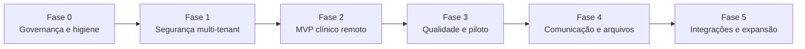

# Roadmap priorizado

Este roadmap é sequenciado por risco e dependência. Prazos devem ser estimados pela equipe depois de confirmar escopo e capacidade; as fases abaixo não são promessas de calendário.

## Visão de dependências

## Fase 0 — Governança e higiene

Objetivo: tornar o projeto confiável para desenvolvimento colaborativo.

- [ ] Confirmar nome, público, MVP e módulos fora de escopo.
- [ ] Transformar documentos legados WebDiet em referência arquivada ou manual WebFit validado.
- [ ] Remover `node_modules/` e, se possível, `dist/` do índice Git.
- [ ] Padronizar UTF-8 e corrigir mojibake.
- [ ] Criar CI com install, typecheck, lint, testes e build.
- [ ] Definir CODEOWNERS/revisores para frontend, banco e segurança.
- [ ] Registrar ADRs para backend, multi-tenancy, dados locais e integrações.
- [ ] Criar ambientes local, staging e produção.

Critério de saída: clone limpo e reproduzível, pipeline verde e escopo do MVP aprovado.

## Fase 1 — Segurança multi-tenant e privacidade

Objetivo: permitir evolução sem consolidar falhas estruturais.

- [ ] Adicionar constraints/FKs compostas para relações de tenant.
- [ ] Definir matriz de papéis e políticas por operação.
- [ ] Criar testes reais de RLS com dois usuários, duas clínicas e três papéis.
- [ ] Endurecer policies do Storage para membership atual.
- [ ] Executar Security/Performance Advisors em staging.
- [ ] Configurar Auth de produção: confirmação, recuperação, CAPTCHA, SMTP e MFA por risco.
- [ ] Definir inventário de dados, base legal, consentimento, retenção e direitos LGPD.
- [ ] Definir backup, PITR conforme necessidade e teste de restauração.
- [ ] Criar processo de incidente e segredo.

Critério de saída: relatório de testes demonstra isolamento e plano de privacidade/operação está aprovado.

## Fase 2 — MVP clínico remoto

Objetivo: tornar o fluxo clínico principal consistente em qualquer dispositivo.

### Plataforma frontend

- [ ] Adotar roteamento e lazy loading.
- [ ] Adotar camada de query/cache remoto.
- [ ] Separar contextos/repositórios por domínio.
- [ ] Padronizar validação de formulários e erros.
- [ ] Quebrar `PatientProfile` em componentes/rotas.

### Domínios

- [ ] Completar perfil profissional remoto.
- [ ] Completar gestão e troca de clínica.
- [ ] Melhorar pacientes: validação, paginação, filtros reais e duplicidade.
- [ ] Melhorar agenda: timezone, edição, status, duração e conflitos.
- [ ] Persistir antropometria.
- [ ] Persistir prescrições com rascunho/publicação/versionamento.
- [ ] Persistir planner.
- [ ] Persistir financeiro mínimo e remover reconhecimento automático indevido.
- [ ] Criar RPC transacional para retorno/cobrança, se a regra for aprovada.
- [ ] Migrar/apagar chaves sensíveis legadas do `localStorage`.

Critério de saída: um profissional completa atendimento básico usando apenas dados remotos, auditados e consistentes.

## Fase 3 — Qualidade, UX e piloto controlado

Objetivo: reduzir risco operacional e validar uso real.

- [ ] Playwright para login, clínica, paciente, agenda, avaliação e prescrição.
- [ ] Testes de integração de repositories/migrações.
- [ ] Auditoria de acessibilidade e teclado.
- [ ] Substituir alerts/prompts e remover ações falsamente concluídas.
- [ ] Error tracking e logs estruturados sem dados clínicos.
- [ ] Métricas de produto com consentimento/minimização.
- [ ] Teste de carga e plano de capacidade.
- [ ] Runbooks de deploy, rollback, indisponibilidade e suporte.
- [ ] Piloto com clínicas selecionadas e feature flags.
- [ ] Revisão de segurança antes de ampliar usuários.

Critério de saída: piloto opera com métricas, suporte, rollback e erros dentro dos limites definidos.

## Fase 4 — Comunicação, diário e documentos

Objetivo: habilitar colaboração segura entre profissional e paciente.

- [ ] Definir/autenticar portal ou app do paciente.
- [ ] Criar tabela de refeições/diário alimentar.
- [ ] Integrar Storage, signed URLs e retenção de arquivos.
- [ ] Persistir chat e notificações.
- [ ] Integrar Realtime com autorização testada.
- [ ] Implementar pré-consulta e respostas.
- [ ] Gerar PDFs reais, versionados e armazenados.
- [ ] Templates e fila de mensagens idempotente.
- [ ] Integrar e-mail/WhatsApp via Edge Functions.

Critério de saída: comunicação funciona ponta a ponta sem `localStorage`, com consentimento, auditoria e entrega observável.

## Fase 5 — Integrações e expansão

Objetivo: adicionar diferenciais depois de o núcleo estar seguro.

- [ ] Pagamentos, webhooks e conciliação.
- [ ] Calendários externos.
- [ ] Landing pages/leads com consentimento e opt-out.
- [ ] Teleconsulta por provedor validado.
- [ ] Wearables/MoveHealth.
- [ ] Conteúdo, cursos e benefícios com CMS.
- [ ] IA clínica/administrativa com governança e revisão humana.

Critério de saída: cada integração possui owner, SLA, custo, política de dados, observabilidade e plano de descontinuação.

## Backlog técnico priorizado

| ID | Prioridade | Item | Dependência |
|---|---|---|---|
| SEC-001 | P0 | FKs compostas por tenant | nenhuma |
| SEC-002 | P0 | testes RLS multi-tenant | SEC-001 |
| PRIV-001 | P0 | política LGPD e retenção | decisão stakeholder |
| DATA-001 | P0 | retirar dados sensíveis do navegador | repositórios por domínio |
| REPO-001 | P0 | remover artefatos rastreados | confirmar deploy |
| AUTH-001 | P1 | confirmação/recuperação/MFA/CAPTCHA | SMTP e política de conta |
| ARCH-001 | P1 | dividir AppContext/PatientProfile | definição MVP |
| DEVX-001 | P1 | CI + staging + E2E | ambientes |
| CLIN-001 | P1 | antropometria remota | ARCH-001/SEC-002 |
| CLIN-002 | P1 | prescrição remota/versionada | decisões clínicas |
| FIN-001 | P1 | financeiro remoto/transacional | regra contábil |
| MSG-001 | P2 | chat/notificações Realtime | portal do paciente |
| FILE-001 | P2 | Storage clínico | policies e retenção |
| UX-001 | P2 | remover alerts e ações simuladas | componentes compartilhados |
| INT-001 | P3 | integrações externas | núcleo estável |

## Backlog de UI existente

O arquivo `backlog-webfit.md` registra pedidos de stakeholders que continuam válidos para discovery:

- reorganizar substituições do cardápio;
- revisar granularidade do seletor de cores;
- adicionar acesso à análise de exames;
- recuperar/transcrever áudios incompletos.

Esses itens devem entrar no planejamento somente após validar o material original e identificar sua dependência com os domínios ainda não implementados.

## Critério de priorização

Ordenar tarefas pela fórmula qualitativa:

1. risco de segurança/privacidade;
2. bloqueio de fluxo principal;
3. dependência para outras entregas;
4. impacto comprovado no usuário;
5. esforço e reversibilidade.

Novas features de demonstração não devem ultrapassar correções P0/P1 do núcleo clínico.
